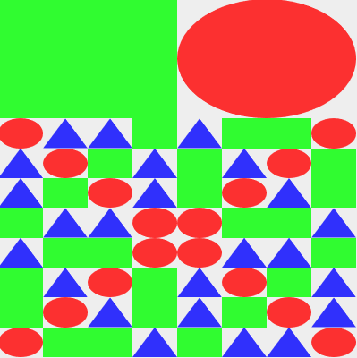

# Lengdib-elm

Portando [lengdib](https://gitlab.com/karen.p/lengdib) a elm.

## Correr servidor

Hace falta tener instalado [parcel](https://parceljs.org/getting_started.html).

Con este comando se inicia el servidor (y se instalan todas las dependencias que sean necesarias).

`parcel src/index.html`

Es probable que tengas que tener instalado [elm](https://guide.elm-lang.org/install/elm.html).

## Notas de conversión

### Sobre elm

En elm no existen los `typeclasses`, o sea que no se puede declarar algo como "mónada" o "functor aplicativo".
Sin embargo, sí se pueden declarar la función `bind`, que es lo que importa.

En elm la función `bind` se llama `andThen` y tiene los argumentos invertidos, para poder hacer _pipe_.

Le digo "hacer _pipes_" cuando se usa la función `|> : a -> (a -> b) -> b` para encadenar llamadas.

```elm
    -- Sin pipes
    List.filter (\x -> modBy 2 x == 0)
        (List.map ((*) 3) [1, 2, 3, 4, 5, 6])

    -- Con pipes
    [1, 2, 3, 4, 5, 6]
        |> List.map ((*) 3)
        |> List.filter (\x -> modBy 2 x == 0)
```

Elm tiene una manera muy particular de indentar el código,
pero la instalación viene con `elm format` que te formatea el código automáticamente.
Se recomienda configurar el editor para formatear al guardar ("Format on save").

Para aprender más de elm recomiendo la [guía oficial](https://guide.elm-lang.org/)
y la [documentación de los paquetes](https://package.elm-lang.org/), que son excelentes.
Tener cuidado al buscar en google! A veces sale la documentación de versiones anteriores.

### Dibujar

Por ahora, para probar un dibujo hay que escribirlo en el código y compilar de nuevo.

Por ejemplo, el siguiente dibujo se escribe así:

```elm
-- src/Main.elm
import Basicas exposing (Basicas(..))
import Dibujo exposing (apilar, juntar, simple)

main =
    Dibujo.aHtml ( 400, 400 ) Basicas.interprete dibujo

dibujo =
    apilar 0.33
        (juntar 0.5 (simple Cuadrado) (simple Circulo))
        (cuadrantesRecursivo 3 intToBasicas)
```



En este caso hicimos un dibujo con figuras `Basicas`. Se pueden hacer muchos tipos de figuras, sólo es necesaria la función `interprete : (Int, Int) -> Figura -> Html msg`.

## Roadmap

Algunas cosas que faltan:

- Más tipos de figuras, como `Basica`, pero usando imágenes.
- Las función `escher` y sus dependencias.
- Las funciones de `Dibujo a`, por ejemplo:
  - `map : (a -> b) -> Dibujo a -> Dibujo b`
  - `fold : ...` (como `semantica` en la versión en haskell)
  - `apply : Dibujo (a -> b) -> Dibujo a -> Dibujo b`
  - `andThen : (a -> Dibujo b) -> Dibujo a -> Dibujo b` (como el `bind` en haskell)

## Licencia

Se usa GNU-GPL igual que el [repositorio original](https://gitlab.com/karen.p/lengdib).
